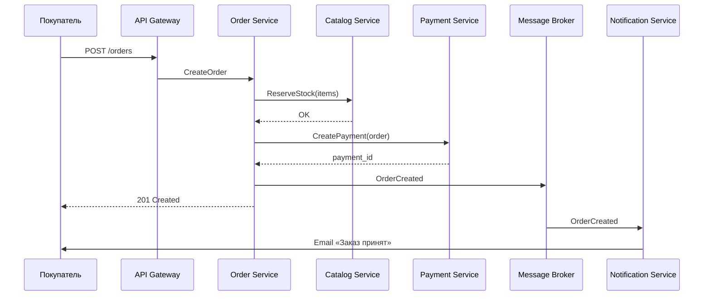
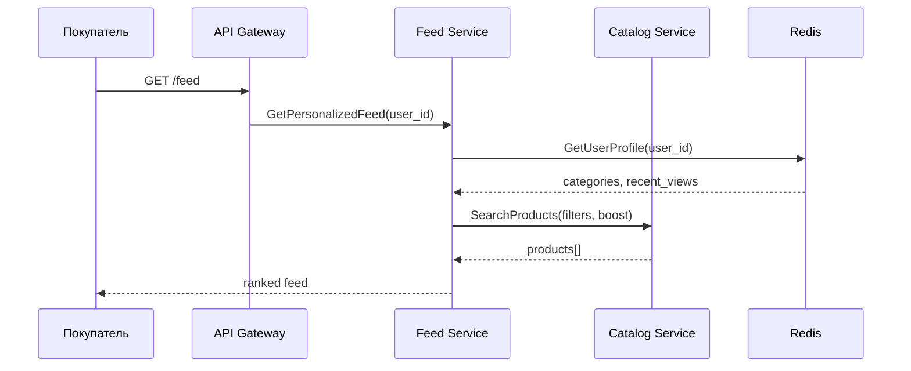

# Архитектура маркетплейса

## Обзор

Маркетплейс — цифровая платформа, где **продавцы** размещают товары, а **покупатели** просматривают персонализированную ленту и оформляют заказы. Система построена как набор **слабо связанных микросервисов** с **событийно-ориентированной** интеграцией для асинхронных процессов (уведомления, аналитика персонализации).

## Ключевые возможности

| Возможность | Сервис | Краткое описание |
|---|---|---|
| Персонализированная лента | Feed Service | Гибридная выдача: популярность + категорийные предпочтения + недавние просмотры |
| Каталог товаров | Catalog Service | CRUD товаров продавцами, поиск и фильтрация |
| Пользователи | User Service | Регистрация, роли (buyer/seller), профили |
| Заказы | Order Service | Корзина → резервирование → оформление → статусы |
| Платежи | Payment Service | Расчёт суммы, комиссия маркетплейса, учёт транзакций |
| Уведомления | Notification Service | Email/push о смене статуса заказа |

## C4-диаграммы

- [Уровень 1 — System Context](c4/01-context.md)
- [Уровень 2 — Containers](c4/02-containers.md)
- [Уровень 3 — Components (Order Service)](c4/03-components-order.md)

## Потоки данных

### Оформление заказа



### Персонализация ленты



## Персонализация

Реализуется **гибридной моделью** (см. [ADR-003](adr/003-personalization-strategy.md)):

1. **Базовый слой** — популярные товары за 7 дней (cold start для новых пользователей).
2. **Категорийный boost** — веса категорий из истории просмотров и покупок.
3. **Recency decay** — недавно просмотренные категории получают повышенный вес с экспоненциальным затуханием.
4. **Diversity penalty** — штраф за повтор одной категории подряд, чтобы лента не была однородной.

Профиль пользователя хранится в Redis; события `ProductViewed`, `OrderCompleted` публикуются в брокер и обрабатываются Feed Service асинхронно.

## Технологический стек

| Слой | Технологии |
|---|---|
| API | REST через API Gateway (Kong / NGINX) |
| Сервисы | Python (FastAPI) / Go — по домену |
| БД | PostgreSQL (per-service), Redis (кэш, профили) |
| Поиск | Elasticsearch (каталог) |
| Брокер | RabbitMQ (события заказов и уведомлений) |
| Контейнеризация | Docker, оркестрация — Kubernetes (prod) |
| Наблюдаемость | OpenTelemetry, Prometheus, Grafana |

## Развёрнутый сервис

В рамках задания поднят **Catalog Service** — управление товарным каталогом продавцов.

```bash
docker compose up --build
```

См. [services/catalog-service/README.md](../services/catalog-service/README.md).

## Архитектурные решения

Документированы в каталоге [docs/adr/](adr/):

- [ADR-001: Микросервисная архитектура](adr/001-microservices.md)
- [ADR-002: Событийная интеграция](adr/002-event-driven-integration.md)
- [ADR-003: Стратегия персонализации](adr/003-personalization-strategy.md)
- [ADR-004: Database per service](adr/004-database-per-service.md)
- [ADR-005: API Gateway](adr/005-api-gateway.md)
