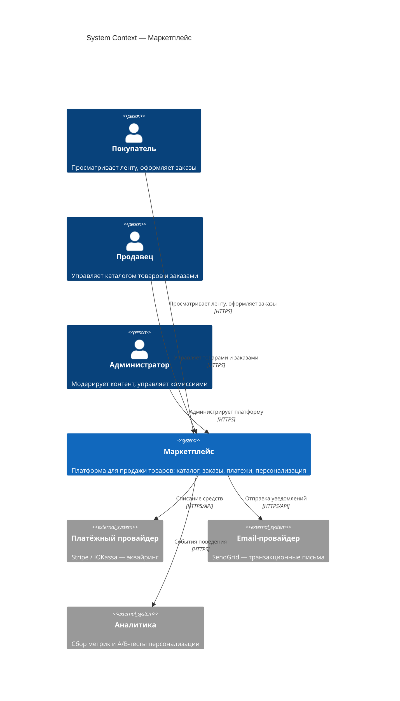

# C4 Level 1 — System Context

Диаграмма контекста показывает маркетплейс как единую систему и её связи с пользователями и внешними системами.

## Акторы

- **Покупатель** — регистрируется, получает персонализированную ленту, добавляет товары в корзину и оплачивает заказы.
- **Продавец** — создаёт и редактирует карточки товаров, отслеживает статусы заказов по своим товарам.
- **Администратор** — модерирует каталог, настраивает комиссию маркетплейса, управляет пользователями.

## Внешние системы

- **Платёжный провайдер** — проведение платежей; маркетплейс не хранит PAN/CVV, только токены и статусы.
- **Email-провайдер** — доставка уведомлений о статусах заказов.
- **Аналитика** — опциональный контур для экспериментов с алгоритмами персонализации.
