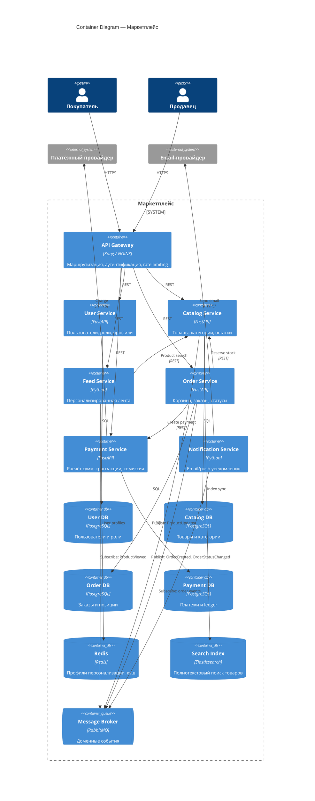

# C4 Level 2 — Containers

Диаграмма контейнеров описывает основные deployable-единицы системы и их взаимодействие.

## Описание контейнеров

| Контейнер | Ответственность |
|---|---|
| **API Gateway** | Единая точка входа, JWT-валидация, маршрутизация к сервисам |
| **User Service** | Регистрация, аутентификация, роли `buyer` / `seller` |
| **Catalog Service** | CRUD товаров, управление остатками, индексация в Elasticsearch |
| **Feed Service** | Ранжирование ленты на основе профиля пользователя в Redis |
| **Order Service** | Жизненный цикл заказа: `created → paid → shipped → delivered` |
| **Payment Service** | Расчёт итога с комиссией, вызов провайдера, бухгалтерский ledger |
| **Notification Service** | Подписка на события заказов, отправка email |

## Синхронное vs асинхронное взаимодействие

- **Синхронно (REST):** оформление заказа требует немедленной проверки остатков и создания платежа.
- **Асинхронно (RabbitMQ):** уведомления, обновление профиля персонализации, синхронизация поискового индекса.
