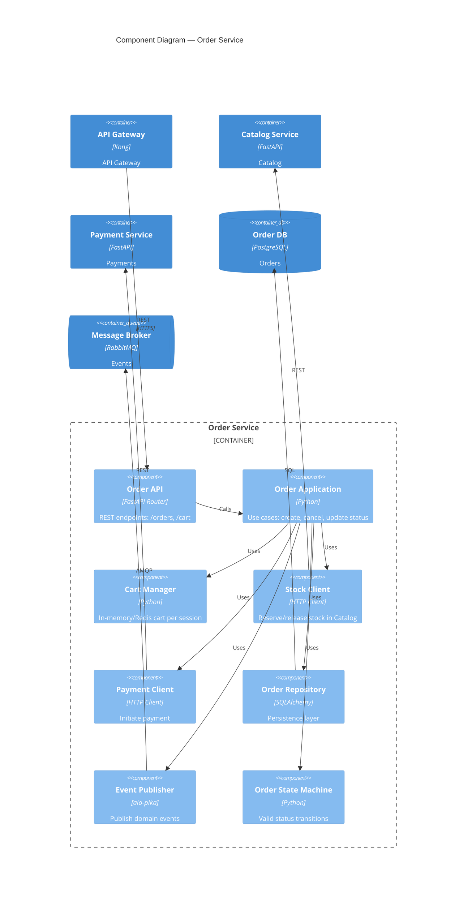
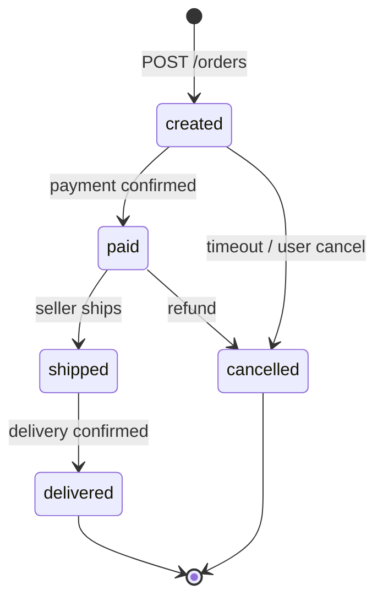

# C4 Level 3 — Components (Order Service)

Детализация внутренней структуры **Order Service** — сервиса, координирующего оформление заказов.

## Компоненты

| Компонент | Назначение |
|---|---|
| **Order API** | HTTP-слой: валидация запросов, маппинг DTO |
| **Order Application** | Оркестрация сценариев: создание заказа, отмена, смена статуса |
| **Cart Manager** | Корзина покупателя до оформления (Redis, TTL 7 дней) |
| **Stock Client** | Резервирование и освобождение остатков через Catalog Service |
| **Payment Client** | Создание платежа и polling статуса |
| **Order Repository** | CRUD заказов и позиций в PostgreSQL |
| **State Machine** | Допустимые переходы: `created→paid→shipped→delivered`, `*→cancelled` |
| **Event Publisher** | Публикация `OrderCreated`, `OrderStatusChanged` в RabbitMQ |

## Машина состояний заказа

